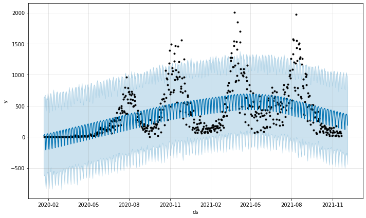

# COVID-19 caseload and mortality analysis and prediction
Final year project which is partial fulfillment of requirements for a of a Bachelor’s 
of Science (Computer Science) at Kenyatta University. 

The objectives of the project hosted in this repository are; 
+ Analyze the state of tracking applications and availability of open-source code  for their implementation, 
+ Design an open-source solution which is easy to deploy and use, 
+ Create an interactive dashboard app tracking the number of cases and deaths by country and region, 
+ Build a model, in Python, that predicts the cases  for the next 14 days in a country /region selected by the user, 
+ Create a daily report generation engine that shows the state of vaccinations  worldwide.

## Contents of the repository
1. Concept Paper
2. Project Proposal Document
3. Analysis Document
4. Solution Design
5. Source Files

